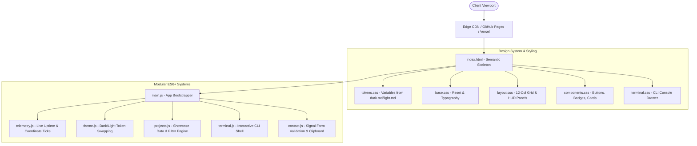

# Architecture & Technical Organization
## Project: Apex Telemetry Portfolio
**Owner:** Aditya Prasad Sahu  
**Repository:** `sahuadityaprasad40-cmyk/Portfolio`  
**System Architecture:** Static Edge-Deployed Modular Web Application

---

## 1. System Architectural Overview
The **Apex Telemetry Portfolio** is structured as an ultra-fast, zero-runtime-overhead static application. To achieve the aesthetic precision of aerospace telemetry without sacrificing sub-second loading times or battery efficiency on mobile devices, the architecture relies exclusively on **native web platform standards** (HTML5 Semantic Markup, Vanilla CSS Custom Properties, and Vanilla ES Modules).



---

## 2. Directory & File Organization
The codebase adheres to a modular, decoupled directory structure where styles, business logic, content data, and assets are cleanly separated.

```
Portfolio1/
├── index.html                  # Single-Page Application entrypoint with full semantic markup
├── favicon.svg                 # Precision telemetry SVG icon
├── robots.txt                  # Search engine crawler instructions
├── sitemap.xml                 # Search engine sitemap index
│
├── css/
│   ├── main.css                # Master CSS bundle aggregator
│   ├── tokens.css              # Design tokens (Colors, Typography, Spacing, Radii from dark.md)
│   ├── base.css                # Typography rules, resets, and utility classes
│   ├── layout.css              # 12-col responsive grid, sticky rails, header, footer
│   ├── components.css          # Project cards, HUD badges, buttons, telemetry bars
│   └── terminal.css            # Tactical CLI overlay & terminal emulator styles
│
├── js/
│   ├── main.js                 # Application orchestration & entry lifecycle
│   ├── data/
│   │   ├── projects.data.js    # Data source for featured projects & case studies
│   │   ├── skills.data.js      # Competency metrics & telemetry levels
│   │   └── experience.data.js  # Career timeline & academic milestones
│   └── modules/
│       ├── theme.js            # Theme switching (dark.md/light.md) with localStorage sync
│       ├── telemetry.js        # Real-time UTC clock, uptime counter, and status pingers
│       ├── projects.js         # Dynamic card rendering & interactive category filtering
│       ├── terminal.js         # Interactive command palette & CLI emulator
│       └── contact.js          # Transmission form validation and one-click copy handlers
│
├── assets/
│   ├── icons/                  # SVG icons (GitHub, LinkedIn, Terminal, ExternalLink, Mail)
│   ├── images/                 # Project screenshots, architectural schematics, profile assets
│   └── docs/                   # Resume / Curriculum Vitae (PDF)
│
└── context/ (Project Documentation & Context Files)
    ├── PRD.md                  # What you are building and why
    ├── Architecture.md         # Application structure and technical organisation (This file)
    ├── rules.md                # What the AI should use, avoid or preserve
    ├── phases.md               # How the project is divided into stages
    ├── design.md               # Visual design rules
    ├── memory.md               # What is finished, in progress or important to remember
    ├── dark.md                 # Master Dark Mode design tokens and style specifications
    └── light.md                # High-Visibility Light Mode design tokens
```

---

## 3. Component & Module Architecture

### 3.1 Layout Shell & Header Telemetry HUD
- **Role:** Provides persistent navigation and situational awareness.
- **Implementation:** `<header>` fixed at top with `backdrop-filter: blur(12px)` and hairline bottom border.
- **Sub-elements:**
  - Branding: `ADITYA PRASAD SAHU // APEX-01`
  - Dynamic System Telemetry: Live UTC digital clock, operational status badge (`SYSTEM READY / AVAILABLE`).
  - Nav links with indexed markers: `01. OVERVIEW`, `02. PROJECTS`, `03. ARSENAL`, `04. TIMELINE`, `05. CONTACT`.
  - Terminal launcher button (`[ >_ TERMINAL ]`).

### 3.2 Hero Command Center
- **Role:** High-impact introduction delivering Aditya's engineering identity and focus areas.
- **Implementation:** Full-viewport or high-prominence grid section featuring `Space Grotesk` typography, system coordinates tag, key value metrics, and primary action triggers.

### 3.3 Project Showcase Matrix
- **Role:** Render, filter, and inspect high-craft case studies.
- **Data-Driven:** Cards dynamically populated from `js/data/projects.data.js` or static semantic templates for instant SEO indexing.
- **Capabilities:**
  - Filtering by tag (Systems, Full-Stack, Creative Tech, DevOps).
  - Telemetry footer displaying stack metrics and source links.

### 3.4 Skills Telemetry Inspector
- **Role:** Data-dense competency display representing technical mastery.
- **Implementation:** Grid of skill modules with segmented visual level bars (e.g. 10 discrete blocks where filled blocks use `#FF6B00`).

### 3.5 Chronological Mission Log (Experience & Education)
- **Role:** Narrative career trajectory formatted as an engineering deployment history.
- **Implementation:** Stepped timeline with monospaced timestamps, role descriptors, technical deliverables, and key milestone flags.

### 3.6 Interactive Terminal Subsystem (`terminal.js`)
- **Role:** Standout developer easter egg and quick navigational tool.
- **State Machine:**
  - States: `CLOSED`, `OPENED`, `EXECUTING`.
  - Key bindings: `~` or `Ctrl + K` or clicking HUD icon.
  - History buffer: Up/Down arrow key command recall.
  - Commands: `help`, `skills`, `projects`, `contact`, `clear`, `sudo`, `exit`.

### 3.7 Contact & Signal Transmission Engine
- **Role:** Direct conversion funnel.
- **Implementation:** Native form handling with input sanitization, dynamic validation indicators, feedback state alerts, and copy-to-clipboard API integration.

---

## 4. State Management & Data Flow
The client maintains minimal, purposeful application state without bloated state libraries:
- **Theme State:** Saved in `localStorage.getItem('apex_theme') || 'dark'`. Setting data attribute on root `<html>` (`data-theme="dark"` or `data-theme="light"`).
- **Navigation State:** Active link synchronization via native `IntersectionObserver` observing sections.
- **Project Filter State:** Simple string filter matching project tags, toggling DOM visibility via CSS classes with smooth opacity transitions.
- **Terminal State:** Command history array and cursor position managed in memory.

---

## 5. Performance, Security & SEO Strategy

### 5.1 Performance Optimization
- **Critical CSS Inlining:** Key layout and typography variables loaded synchronously in `<head>` to eliminate FOIT/FOUC.
- **Modern Font Loading:** Preconnect to Google Fonts (`fonts.googleapis.com`), `font-display: swap` for `Space Grotesk`, `Inter`, and `JetBrains Mono`.
- **Zero Third-Party Dependencies:** No jQuery, no massive component libraries, no analytics bloat that slows down the user experience.

### 5.2 Security
- **Content Security Policy (CSP):** Restricts script execution to internal scripts and trusted Google Fonts endpoints.
- **Safe Link Handling:** All external links enforce `rel="noopener noreferrer"`.
- **Zero Insecure Endpoints:** All form transmissions submit via secure API endpoints (e.g., Formspree/Web3Forms) or fallback to mailto.

### 5.3 SEO & Discoverability
- Semantic HTML tags throughout (`<article>`, `<header>`, `<main>`, `<time>`, `<section>`).
- Open Graph protocol and Twitter Card meta tags for rich link previews.
- Structured JSON-LD schema markup (`Person` & `ProfilePage`) for search engine knowledge graphs.
