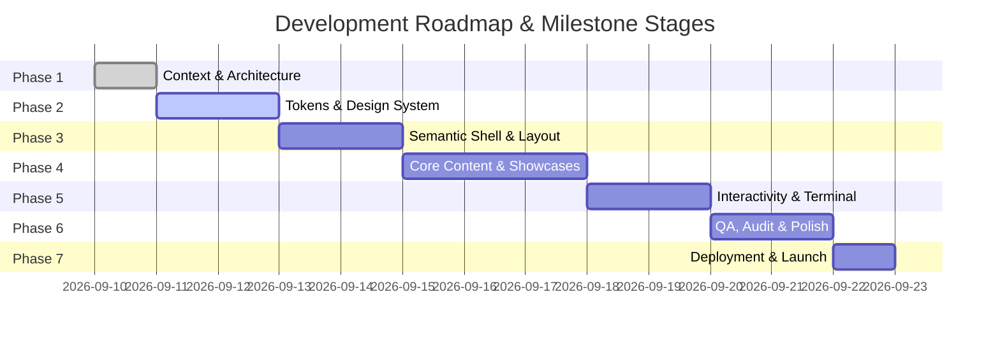

# Implementation Roadmap & Project Phases
## Project: Apex Telemetry Portfolio
**Owner:** Aditya Prasad Sahu  
**Methodology:** Staged Progressive Delivery (Architecture -> Foundations -> Core UI -> Interactivity -> Polish -> Deployment)

---

## Roadmap Overview

---

## Detailed Phase Breakdown

### Phase 1: Context & Architectural Groundwork
**Status:** `COMPLETED`  
**Focus:** Define requirements, architecture, constraints, visual specifications, and context memory.
- [x] Create Product Requirements Document ([PRD.md](file:///c:/Users/HP/OneDrive/Desktop/Portfolio1/PRD.md)).
- [x] Create Technical Architecture Guide ([Architecture.md](file:///c:/Users/HP/OneDrive/Desktop/Portfolio1/Architecture.md)).
- [x] Define AI Engineering Guidelines & Guardrails ([rules.md](file:///c:/Users/HP/OneDrive/Desktop/Portfolio1/rules.md)).
- [x] Define Phased Roadmap & Tracking ([phases.md](file:///c:/Users/HP/OneDrive/Desktop/Portfolio1/phases.md)).
- [x] Synthesize Visual Design Rules & Token System ([design.md](file:///c:/Users/HP/OneDrive/Desktop/Portfolio1/design.md)).
- [x] Establish Persistent Project Memory Ledger ([memory.md](file:///c:/Users/HP/OneDrive/Desktop/Portfolio1/memory.md)).
- [x] Verify theme tokens in [dark.md](file:///c:/Users/HP/OneDrive/Desktop/Portfolio1/dark.md) and [light.md](file:///c:/Users/HP/OneDrive/Desktop/Portfolio1/light.md).

---

### Phase 2: Design Tokens & CSS Foundation
**Status:** `COMPLETED`  
**Focus:** Convert design tokens into a robust, high-performance styling engine.
- [x] Create `css/tokens.css` mapping all colors, fonts, radii, and spacing tokens to CSS Custom Properties.
- [x] Implement dark and light mode variable overrides based on `[data-theme="dark"]` and `[data-theme="light"]`.
- [x] Build `css/base.css` with zero-reset standards, Google Fonts imports (`Space Grotesk`, `Inter`, `JetBrains Mono`), and base element styling.
- [x] Build `css/layout.css` configuring the fluid 12-column grid system, container constraints (`max-width: 1440px`), and responsive margin/gutter breakpoints.

---

### Phase 3: Semantic Skeleton & Navigation Shell
**Status:** `COMPLETED`  
**Focus:** Establish the application HTML5 layout and persistent telemetry HUD navigation.
- [x] Author `index.html` with complete SEO metadata, Open Graph tags, viewport meta, and structured data.
- [x] Build `<header class="telemetry-hud">` with sticky positioning, hairline border, and backdrop blur.
- [x] Add live telemetry widgets in the header:
  - Dynamic status indicator (`[SYSTEM ACTIVE / AVAILABLE]`).
  - Real-time UTC / Local clock display.
- [x] Implement responsive navigation menu with index markers (`01. OVERVIEW`, `02. PROJECTS`, etc.).
- [x] Create `js/modules/theme.js` to handle theme switching with persistent `localStorage` cache.

---

### Phase 4: Core Content Sections & Showcase Modules
**Status:** `COMPLETED`  
**Focus:** Implement Aditya's identity, case studies, skills matrix, and career timeline.
- [x] **Hero Command Center:**
  - High-impact headline in Space Grotesk.
  - Telemetry metadata coordinates and role tag.
  - Dual action CTAs (`[DEPLOY CONTACT →]` and `[INSPECT PROJECTS //]`).
  - Direct resume download action with PDF asset.
- [x] **Featured Projects Showcase:**
  - Create `js/data/projects.data.js` containing rich project metadata.
  - Implement Project Card component with hairline borders, tech tags, preview containers, and action links.
  - Implement category filter buttons (`ALL`, `SYSTEMS`, `FRONTEND`, `APIS`).
- [x] **Technical Arsenal (Skills Matrix):**
  - Group competencies by domain (Languages, Frontend, Backend, Tools).
  - Implement segmented telemetry bars with kinetic orange filled blocks.
- [x] **Chronological Mission Log (Timeline):**
  - Experience and education timeline structured as an engineering deployment log.

---

### Phase 5: Interactive Systems & Tactical Terminal
**Status:** `COMPLETED`  
**Focus:** Deliver high-craft interactive systems and communication channels.
- [x] **Tactical CLI Terminal Emulator (`js/modules/terminal.js`):**
  - Slide-out or modal terminal drawer triggered by `~`, `Ctrl+K`, or HUD button.
  - Command interpreter supporting `help`, `about`, `projects`, `skills`, `contact`, `clear`, and `exit`.
  - Up/Down arrow key command history buffer.
- [x] **Signal Transmission Hub (Contact Section):**
  - Styled contact form with floating telemetry labels and HUD focus rings.
  - Input validation with real-time status alerts.
  - One-click copy for email (`sahuadityaprasad40@gmail.com`) with visual toast feedback.
  - Social telemetry link strip (GitHub, LinkedIn, Twitter/X).

---

### Phase 6: QA, Performance Auditing & Visual Polish
**Status:** `READY TO START`  
**Focus:** Rigorous testing, accessibility audits, and micro-interaction polish.
- [ ] Audit performance via Google Lighthouse (Target: 95+ across Performance, Accessibility, Best Practices, SEO).
- [ ] Verify responsive layouts across desktop (1440px/1024px), tablet (768px), and mobile (375px/414px).
- [ ] Test keyboard navigation: Tab index flow, `:focus-visible` rings, screen reader accessibility.
- [ ] Cross-browser validation (Chromium, Firefox, Safari/WebKit).
- [ ] Optimize all SVG assets and static resources for maximum loading velocity.

---

### Phase 7: Deployment & Maintenance
**Status:** `PENDING`  
**Focus:** Production release and ongoing operational stability.
- [ ] Initialize Git commits with clear, descriptive commit messages.
- [ ] Connect remote GitHub repository `sahuadityaprasad40-cmyk/Portfolio`.
- [ ] Configure deployment workflow (GitHub Pages or Vercel edge deployment).
- [ ] Verify custom domain or production URL.
- [ ] Document future upgrade paths in [memory.md](file:///c:/Users/HP/OneDrive/Desktop/Portfolio1/memory.md).

---

## Phase Status Summary Table

| Phase | Phase Name | Status | Deliverables |
|---|---|---|---|
| **Phase 1** | Context & Architecture | `COMPLETED` | 6 Context files (`PRD.md`, `Architecture.md`, `rules.md`, `phases.md`, `design.md`, `memory.md`) |
| **Phase 2** | Tokens & Design System | `COMPLETED` | `tokens.css`, `base.css`, `layout.css`, typography setup |
| **Phase 3** | Semantic Shell & HUD | `COMPLETED` | `index.html`, header HUD, theme toggle, telemetry clocks |
| **Phase 4** | Core Content & Showcases | `COMPLETED` | Hero, Projects matrix, Skills gauges, Experience timeline |
| **Phase 5** | Interactivity & Terminal | `COMPLETED` | Interactive CLI terminal, project filtering, contact hub |
| **Phase 6** | QA, Audit & Polish | `READY` | Lighthouse 95+, responsive validation, a11y testing |
| **Phase 7** | Deployment & Launch | `PENDING` | GitHub push, edge deployment, production verification |

